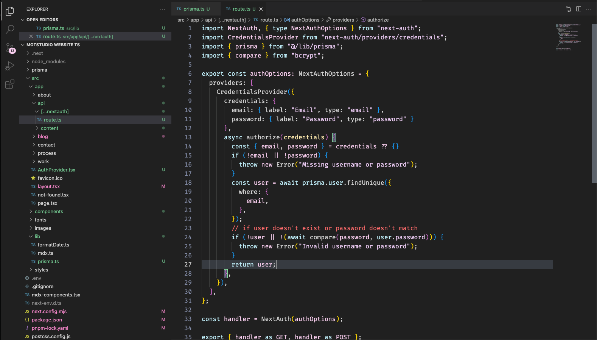

# Vibrant Spectrum VS Code Theme

## Description

Vibrant Spectrum is a colorful and dynamic Visual Studio Code theme designed to make your coding experience more vibrant and exciting. With a rich palette of colors, this theme aims to provide a visually pleasing environment that is both stylish and functional.

## Installation

1. Open Visual Studio Code.
2. Go to the Extensions view by clicking on the square icon in the sidebar or pressing `Ctrl+Shift+X`.
3. Search for "Vibrant Spectrum" and click the "Install" button.
4. Once installed, select the "Vibrant Spectrum" theme from the dropdown menu in the lower-right corner of the window.

## Features

- A diverse and harmonious color palette that makes code stand out.
- Carefully crafted syntax highlighting for a wide range of programming languages.
- Readable and stylish text editor styles.
- Customized UI elements including the activity bar, side bar, status bar, and more.
- Smooth and visually appealing design for enhanced readability.

## Feedback and Contributions

If you have any feedback, suggestions, or issues related to the Vibrant Spectrum theme, feel free to [submit an issue](https://github.com/your-username/vibrant-spectrum-theme/issues) on GitHub. Contributions and improvements are also welcome via pull requests.

## License

This theme is released under the [MIT License](LICENSE.md).
